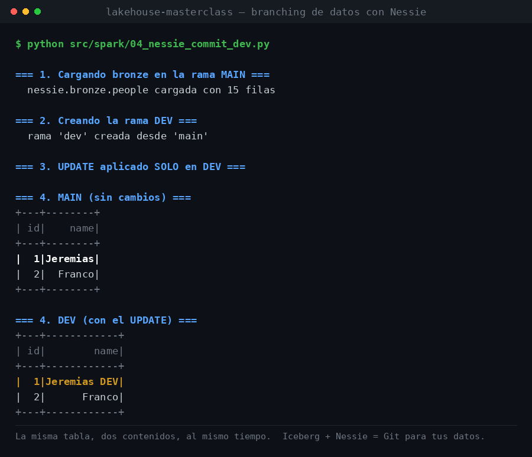

# Lakehouse Masterclass

> Masterclass open-source para construir un **Data Lakehouse** de punta a punta, sin depender de stacks propietarios ni de un único proveedor cloud.

[](https://github.com/jeremiasjaymez/lakehouse-masterclass/actions/workflows/terraform.yml)
[](https://github.com/jeremiasjaymez/lakehouse-masterclass/actions/workflows/python.yml)
[](https://github.com/jeremiasjaymez/lakehouse-masterclass/actions/workflows/dagster.yml)

<p align="center">
  
</p>

<p align="center">
  <em>Salida real del Lab 3. La misma tabla, dos ramas, dos contenidos — al mismo tiempo.</em>
</p>

**En una tarde vas a tener andando, en tu laptop:** tablas ACID con time travel sobre
almacenamiento S3, un catálogo versionado con ramas y merges como Git, un ETL orquestado
con lineage, y un RAG local que responde preguntas sobre tu propia documentación.
Todo open source, todo self-hosted, sin tarjeta de crédito.

<sub><a href="#-english">🇬🇧 English</a> · <a href="docs/docs/guide.md">Guía completa</a> · <a href="docs/docs/appendix/student-runbook.md">Runbook paso a paso</a></sub>

## ¿Qué vas a aprender?

A levantar un Lakehouse completo, reproducible y soberano, usando solo herramientas open-source que podés correr en tu máquina o en cualquier nube:

- **Storage**: MinIO (S3 compatible)
- **Table format**: Apache Iceberg (ACID, time-travel, schema evolution)
- **Catálogo**: Project Nessie como **Iceberg REST Catalog** (ramas, commits, merges + nombres de tres niveles)
- **Compute**: Apache Spark
- **Orquestación**: Dagster (assets, lineage, schedules)
- **Secretos**: HashiCorp Vault
- **IaC**: Terraform
- **CI/CD**: GitHub Actions
- **IA**: Ollama (LLM `llama3.1` + embeddings `nomic-embed-text`, todo local)

## ¿Por qué este stack?

- **Soberanía tecnológica**: todo el stack es self-hostable. No dependés de Databricks, Snowflake ni de un cloud específico.
- **Portabilidad**: el mismo código corre en tu laptop, en un VPS europeo o en cualquier Kubernetes.
- **Educativo**: cada componente está aislado en su propio `docker-compose.*.yml` para que entiendas qué resuelve antes de integrarlo con el resto.

### Un solo catálogo

Nessie implementa el protocolo **Iceberg REST Catalog**, así que Spark, DuckDB y
pyiceberg hablan con el mismo servidor y las tablas se nombran
`nessie.<namespace>.<tabla>`:

```python
spark = get_spark_with_nessie(ref="dev")  # elegís la rama
spark.sql("SELECT * FROM nessie.silver.people")  # nombres, no rutas S3
```

El Lab 2 usa a propósito el catálogo `hadoop` (sin servidor, tablas por ruta) para
mostrar el escalón anterior. **Del Lab 3 en adelante todo vive en Nessie**, así que
bronze, silver, gold y el índice RAG comparten un único catálogo versionado por ramas.

### Sobre las licencias (importante)

La mayoría del stack es open source de verdad (Apache-2.0, MIT, MPL-2.0, AGPL-3.0).
**Dos herramientas no lo son**: en agosto de 2023 HashiCorp relicenció **Vault** y
**Terraform** a **BUSL-1.1** (*source-available*, hoy con IBM como licenciante).

En vez de esconderlo bajo la etiqueta "open source", la masterclass lo usa como
material: los Labs [6](docs/docs/labs/lab-06-vault.md) y
[7](docs/docs/labs/lab-07-terraform.md) explican qué cambió, por qué pasó, y cómo
migrar a los forks libres de la Linux Foundation — **OpenBao** y **OpenTofu** — con
un cambio de una línea. Para eso está `docker-compose.openbao.yml` en el repo.

| Herramienta | Licencia | Alternativa libre |
|---|---|---|
| Iceberg, Nessie, Spark, Dagster, Polaris | Apache-2.0 | — |
| DuckDB, Ollama | MIT | — |
| MinIO | AGPL-3.0 | — |
| **Vault** | **BUSL-1.1** (IBM) | OpenBao (MPL-2.0) |
| **Terraform** | **BUSL-1.1** (IBM) | OpenTofu (MPL-2.0) |

Elegir una herramienta es apostar también a su modelo de negocio. Esa es una
decisión de arquitectura, igual que elegir el formato de tabla.

## Stack

```text
            +-----------+   +-----------+
            | Terraform |   |   Vault   |
            +-----+-----+   +-----+-----+
                  |               |
                  v               v
            +-----+---------------+-----+
            |          Dagster          |  <- orquestación
            +-----+---------------+-----+
                  |               |
                  v               v
+--------+   +----+-----+   +-----+-----+
|  IA    |<->|  Spark   |<->|  Nessie   |  <- catálogo versionado
+--------+   +----+-----+   +-----+-----+
                  |               |
                  v               v
            +-----+---------------+-----+
            |   Iceberg (tablas ACID)   |
            +------------+--------------+
                         v
                  +------+------+
                  |    MinIO    |  <- storage
                  +-------------+
```

## Cómo arrancar

### Opción A — En el navegador, sin instalar nada

[](https://codespaces.new/jeremiasjaymez/lakehouse-masterclass)

El repo trae un devcontainer con **Python 3.12, Java 17, Docker y uv ya configurados**:
el Lab 0 viene hecho. Abrilo en Codespaces (o en VS Code con *Dev Containers: Reopen in
Container*) y arrancá directo:

```bash
docker compose up -d              # MinIO + Nessie + Vault
python src/spark/01_test_spark.py
```

Para los labs de IA (9 y 11), que necesitan ~5 GB de modelos:

```bash
bash .devcontainer/setup-ollama.sh
```

### Opción B — En tu máquina

1. Cloná el repo.
2. Copiá los archivos de entorno: `cp .env.example .env` y `cp lakehouse_dagster/.env.example lakehouse_dagster/.env`.
3. Seguí el [Lab 0 - Setup Global](docs/docs/labs/lab-00-setup-global.md) para preparar WSL2 + Docker + uv.
4. Avanzá lab a lab desde la [guía](docs/docs/guide.md).

¿Querés la secuencia exacta comando por comando? Está en el
[Recorrido del alumno](docs/docs/appendix/student-runbook.md).

## Estructura del repo

```text
docs/                  # MkDocs con la guía y los 12 labs (0-11)
src/
  spark/               # Scripts Spark numerados por paso
  ai/                  # Embeddings, SQL generator y utilidades RAG
  nessie/              # Branching/merging de Nessie
  vault/               # Lectura de secretos
  minio/, duckdb/      # Storage y capa de lectura analítica
infra/terraform/       # Infra como código
lakehouse_dagster/     # Proyecto Dagster (assets, jobs, schedules)
data/                  # bronze/silver/gold de ejemplo
docker-compose.*.yml   # Un compose por servicio (MinIO, Nessie, Vault)
```

## Labs

| # | Lab | Tema |
|---|-----|------|
| 0 | [Setup global](docs/docs/labs/lab-00-setup-global.md) | WSL2 + Docker + uv |
| 1 | [MinIO](docs/docs/labs/lab-01-minio.md) | Storage S3-compatible |
| 2 | [Iceberg](docs/docs/labs/lab-02-iceberg.md) | Table format ACID |
| 3 | [Nessie](docs/docs/labs/lab-03-nessie.md) | Catálogo versionado |
| 4 | [Spark](docs/docs/labs/lab-04-spark.md) | Compute + ETL bronze→silver |
| 5 | [Dagster](docs/docs/labs/lab-05-dagster.md) | Orquestación |
| 6 | [Vault](docs/docs/labs/lab-06-vault.md) | Secret management |
| 7 | [Terraform](docs/docs/labs/lab-07-terraform.md) | Infra como código |
| 8 | [CI/CD](docs/docs/labs/lab-08-ci-cd.md) | GitHub Actions |
| 9 | [IA](docs/docs/labs/lab-09-ai.md) | Embeddings + LLM local |
| 10 | [Capstone](docs/docs/labs/lab-10-capstone.md) | Pipeline end-to-end |
| 11 | [RAG (bonus)](docs/docs/labs/lab-11-rag.md) | RAG local sobre Iceberg |

## Audiencia

Data engineers con experiencia media a senior que quieran entender los **fundamentos** de un Lakehouse moderno sin envolverlos en una plataforma cerrada.

## Credenciales de demo

Las credenciales que aparecen en los `docker-compose.*.yml` (MinIO `admin`/`password`, Vault token `root`) son **solo para uso local en esta masterclass**. En producción nunca deben estar hardcodeadas — para eso existe el Lab 6 (Vault).

Los archivos `.env` **no se versionan**. Copiá los ejemplos antes de arrancar:

```bash
cp .env.example .env
cp lakehouse_dagster/.env.example lakehouse_dagster/.env   # ajustá DAGSTER_HOME
```

## 🇬🇧 English

**An open-source Data Lakehouse masterclass — 12 hands-on labs that run entirely on your laptop.**

The course material is in **Spanish**, but the code, scripts and configuration are
language-agnostic and the architecture is worth a look regardless.

You build a complete lakehouse from scratch: **MinIO** (S3-compatible storage),
**Apache Iceberg** (ACID tables, time travel, schema evolution), **Project Nessie** as an
**Iceberg REST Catalog** (Git-like branches, commits and merges over your data),
**Apache Spark** for compute, **Dagster** for asset-based orchestration, **Vault** for
secrets, **Terraform** for IaC, and a fully local **RAG pipeline** (Ollama) whose vector
index lives in an Iceberg table — no vector database involved.

Two things make it different from the usual tutorial:

- **It teaches licensing as architecture.** Vault and Terraform are BUSL-1.1
  (source-available, licensed by IBM), not open source. Instead of hiding that, Labs 6
  and 7 explain what changed and how to swap in the Linux Foundation forks —
  **OpenBao** and **OpenTofu** — with a one-line change.
- **Everything is pinned and reproducible**, down to Docker image tags and the `uv`
  installer version, so the labs still work a year from now.

**Quickstart** — zero install, runs in your browser:

[](https://codespaces.new/jeremiasjaymez/lakehouse-masterclass)

```bash
docker compose up -d              # MinIO + Nessie + Vault
python src/spark/01_test_spark.py
```

The devcontainer ships Python 3.12, Java 17, Docker and uv preconfigured.
Apache-2.0 — fork it, teach it, use it at work.

## Licencia

Apache-2.0
